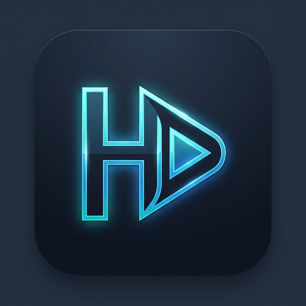

<p align="center">
  
</p>

<p align="center">
  <b>Android telefon ve tabletler için yeni nesil IPTV oynatıcı</b><br>
  <sub>Dokunmatik odaklı · TV sürümüyle aynı güçlü motor — M3U, Xtream veya Stalker (MAC) kaynaklarınızı ekleyin</sub>
</p>

<p align="center">
  
  
  
  
  
</p>

---

HanTV Mobil, Android telefon ve tabletler için özel olarak geliştirilmiş yerli ve modern bir IPTV oynatıcısıdır.
Film ve diziler için **libmpv (FFmpeg)**, anında canlı TV geçişleri için **ExoPlayer (Media3)** çift oynatma motoruna sahiptir.

> ⚠️ HanTV herhangi bir kanal, yayın veya içerik barındırmaz ve sağlamaz.
> Kullanıcılar kendi yasal IPTV veya medya kaynaklarını ekler.

---

## 💬 Topluluk & Destek

Soru, öneri ve destek için **HanTV Telegram Grubumuza katılın:**

### 👉 [t.me/HanTVPlayer](https://t.me/HanTVPlayer)

<a href="https://t.me/HanTVPlayer"></a>

---

## ✨ Features

### 🎬 Playback

- **Two engines** — libmpv for films and series and the widest codec/HDR support, ExoPlayer for
  fast-starting Live TV, with an automatic handover between them and a **per-channel compatibility
  mode** when a stream only likes one of them.
- **Full-screen player** with the complete control bar — including **previous and next episode** —
  and **touch gestures** for skip, scrub, volume, brightness, zoom, speed and mute.
- **Picture-in-Picture**, a **draggable floating window**, and a **docked mini player** above the
  tabs — whichever you prefer, or none.
- **Sound-only mode** with artwork, volume to 150 % and a sleep timer; it can switch itself on when
  the screen goes off or you leave Wi-Fi, and it remembers your choice per channel.
- **Catch-up TV**, **rewind live TV** into your provider's archive, and **Go live** again.
- **Multiview** — several live channels at once, with sound on the one you choose.
- Hand a stream to **another player app** if you would rather.

### 🧭 Browse

- **Home** with your own rows in your own order, a hero card for what you were watching, and
  continue-watching rows for films and shows.
- **Live TV, Movies and Series** with categories, sorting, grid or list, and **pinch to resize** the
  posters.
- **TV guide in three shapes** — On now, Grid and Timeline — with day chips, jump-to-now, search and
  a category filter.
- **Film and show details** with the cast, the trailer, seasons, episode progress and Resume; a show
  opens on the season you last watched, and starting something part-watched asks whether to resume or
  start over — or stops asking, if you prefer.
- **Search** across channels, films and shows in one field, grouped by kind, loading more as you
  scroll.
- **Bottom bar on a phone, navigation rail on a tablet**, and two-pane layouts where there is room.

### 📥 Sources & EPG

- **Xtream, M3U (URL or local file) and Stalker/MAG portals**, with a large import that runs in the
  background.
- **EPG** from the playlist or your own XMLTV feeds, with **auto-matching**, a review list, per-feed
  counts, catch-up timezone handling and guide statistics.
- OwnTV **measures how many streams your provider actually allows** and tells you before it has to
  refuse one.

### ⏺️ Recording & downloads

- **Record Live TV** from the guide, the channel list or while you are watching — including **every
  showing** of a programme, and a catch-up programme from the archive.
- **Downloads** with pause, resume, retry, free-space and speed, watchable offline.
- Save downloads and recordings to **a folder you pick**, SD card included, and **export** a copy
  anywhere.

### 👥 Profiles, sync & settings

- **Profiles** with a picture of your own, locking, and kids profiles.
- **Backup & restore** with a password and your own file picker, choosing which profiles and which
  parts of your data travel.
- **Local sync** over your own Wi-Fi — pair by QR or on the network, see exactly what will change
  before it changes, and send, receive or merge.
- **Settings in ten pages** with a search box, reorderable quick toggles, and **Customize** for
  renaming, hiding, reordering and regrouping everything in your library.
- **26 languages**, right-to-left layouts included.

---

## 📸 Screenshots

<table>
  <tr>
    <td align="center"><br><sub>Home — Now Trending</sub></td>
    <td align="center"><br><sub>Live TV</sub></td>
    <td align="center"><br><sub>TV Guide</sub></td>
  </tr>
</table>

<p align="center">
  <br>
  <sub>The player — live channel, full screen</sub>
</p>

---

## 🧱 Tech stack

| | |
|---|---|
| Language | Kotlin 2.4.20 |
| UI | Jetpack Compose, Material 3 |
| Build | AGP 9.4.0, `minSdk` 26, `targetSdk` 36 |
| Engine | [`tv.own.owntv:core`](https://github.com/ahXN00/OwnTV_Core) + `:player-core` — Room, sync, EPG, backup, libmpv and Media3 |
| DI | Koin |
| Networking / images | OkHttp · Coil |

**This repository contains the phone and tablet interface and nothing else.** Every entity,
migration, parser, sync, EPG, backup and playback decision lives in the core library and is shared,
byte for byte, with the television app. If you are looking for how a playlist is parsed or how the
database is versioned, it is [over there](https://github.com/ahXN00/OwnTV_Core).

### Project layout

```
app/                     the phone & tablet UI: navigation, screens, player chrome
  src/main/java/tv/own/owntv/mobile/
    ui/screens/          home · live · library · guide · search · downloads ·
                         recordings · multiview · settings
    ui/components/       the shared surface language (buttons, rows, sheets, glass)
    di/                  Koin modules
tools/i18n/              the locale catalogue and the consumer-side string checks
extras/                  logos, credits artwork, and the TV parity checklist
```

## 📚 Docs (`extras/`)

- 📖 **[User Guide](extras/USER_GUIDE.md)** — every feature and where to find it.
- 📄 **[Master Product Brief](extras/OwnTV_Master_Product_Brief.md)** — the full as-built feature and
  architecture reference.
- ✅ **[Parity checklist](extras/PARITY_CHECKLIST.md)** — every television feature, where it landed
  here, and why the dropped ones cannot exist on a phone.

---

## 📥 Installing

Distribution is **sideloaded** while the app is pre-release: download the APK from the
[Releases page](https://github.com/ahXN00/OwnTV_Mobile/releases) and install it. Each release
carries an arm APK and an `x86_64` one for emulators.

The app checks for a new release itself — on startup if you let it, or from **Settings → App →
Check for updates** — and can download and install it for you. That needs
`REQUEST_INSTALL_PACKAGES`, which the app declares for exactly this and nothing else; Android will
still ask you to allow installs from OwnTV the first time.

---

## 🛠️ Building & running

```bash
git clone https://github.com/ahXN00/OwnTV_Mobile.git
cd OwnTV_Mobile
./gradlew :app:assembleStandardDebug
```

`local.properties` is developer-local and never committed:

```properties
sdk.dir=C:/Users/<you>/AppData/Local/Android/Sdk
```

**Resolving the core library.** By default the build takes the pinned `owntvCore` version from
GitHub Packages, which needs `gpr.user` and `gpr.token` (a PAT with `read:packages`) in
`~/.gradle/gradle.properties`. That is what CI does. To build against a local checkout of core
instead — a composite build, so an edit there reaches the app with no publish step — add this to the
same file, **never to a file in this repository**:

```properties
owntv.corePath=/path/to/OwnTV_Core
```

Signing and keystore values belong in `~/.gradle/gradle.properties` or CI secrets, never in a
repository file. With nothing configured the APK simply builds unsigned.

### Checks

```bash
./gradlew :app:testStandardDebugUnitTest      # unit tests
./gradlew :app:lintStandardDebug              # Android lint
python tools/i18n/check_hardcoded_strings.py verify
python tools/i18n/check_pseudo_locales.py     # needs a built APK
```

---

## 🤝 Contributing

Contributions, bug reports and ideas are welcome — open an issue or a pull request. Please keep the
project's player-only, bring-your-own-source positioning, and match the existing code style.

**Where does a change go?** If it is about the database, playlist sync, EPG, backup, profiles,
downloads, settings storage, the playback engine **or any user-visible text**, it belongs in
[OwnTV_Core](https://github.com/ahXN00/OwnTV_Core), not here. This repository holds the phone and
tablet interface only.

<!-- i18n-contribution:start -->
## Help translate OwnTV

If your language is already available, contribute interface translations across OwnTV's six Android resource components on [Hosted Weblate](https://hosted.weblate.org/projects/owntv/). If it is not listed, [open a language request ticket](https://github.com/ahXN00/OwnTV/issues/new?template=feature_request.yml&title=%5BLanguage%5D%20Add%20) first. A maintainer will review the request, register the locale, and prepare its base translation files on Hosted Weblate. Once the language appears on Hosted Weblate, you can start translating it there. The strings themselves live in [OwnTV's core library repository](https://github.com/ahXN00/OwnTV_Core), together with the language contributor guide covering identifiers, validation, and promotion policy.
<!-- i18n-contribution:end -->

## 🙏 Credits


OwnTV speaks 26 languages because people translate it on
[**Weblate**](https://weblate.org/), which hosts the project free of charge for libre software.
Thank you to Weblate and to every translator who has given the app their language.


Movie & series metadata and trailers are provided by [TMDB](https://www.themoviedb.org/).
**This product uses the TMDB API but is not endorsed or certified by TMDB.**


Subtitle search & download is powered by [OpenSubtitles.com](https://www.opensubtitles.com/).
**This product uses the OpenSubtitles API but is not endorsed or certified by OpenSubtitles.** You
sign in with your own OpenSubtitles account and are subject to their terms and download quotas.

### ▶️ Playback engines

- **[mpv](https://mpv.io/)** (via [libmpv](https://github.com/mpv-android/mpv-android), built on
  [FFmpeg](https://ffmpeg.org/)) — the default engine, for the widest IPTV/codec, audio and HDR
  support.
- **[Media3 / ExoPlayer](https://github.com/androidx/media)** — the fast-start engine for Live TV
  and HLS.

Which of the two starts a stream is yours to set, separately for Live TV and for Movies & Series
(Settings → Video player): either order, or one engine only with the automatic handover turned off.

### 🧩 Built with

[Jetpack Compose](https://developer.android.com/jetpack/compose) ·
[Material 3](https://m3.material.io/) ·
[Room](https://developer.android.com/jetpack/androidx/releases/room) ·
[Koin](https://insert-koin.io/) ·
[OkHttp](https://square.github.io/okhttp/) ·
[Coil](https://coil-kt.github.io/coil/) ·
[ZXing](https://github.com/zxing/zxing) — and the wider Kotlin / AndroidX open-source ecosystem.
Thank you to all their maintainers. See each project for its own license.

## ⚖️ Legal

OwnTV is a media **player** only. It ships with no channels, playlists, subscriptions or content, and
does not endorse or facilitate access to unauthorized streams. Users are solely responsible for the
sources they add and for complying with the laws and rights that apply to them.

## 📄 License

Released under the **GNU General Public License v3.0 (GPLv3)**, the same as the rest of OwnTV.

In short: you're free to use, study, modify and redistribute OwnTV, including commercially — but any
redistributed version (including forks and commercial products built on it) must also be licensed
under GPLv3 and its source made available.

---

<sub>OwnTV is an open-source, player-only project, built with the help of AI.</sub>
